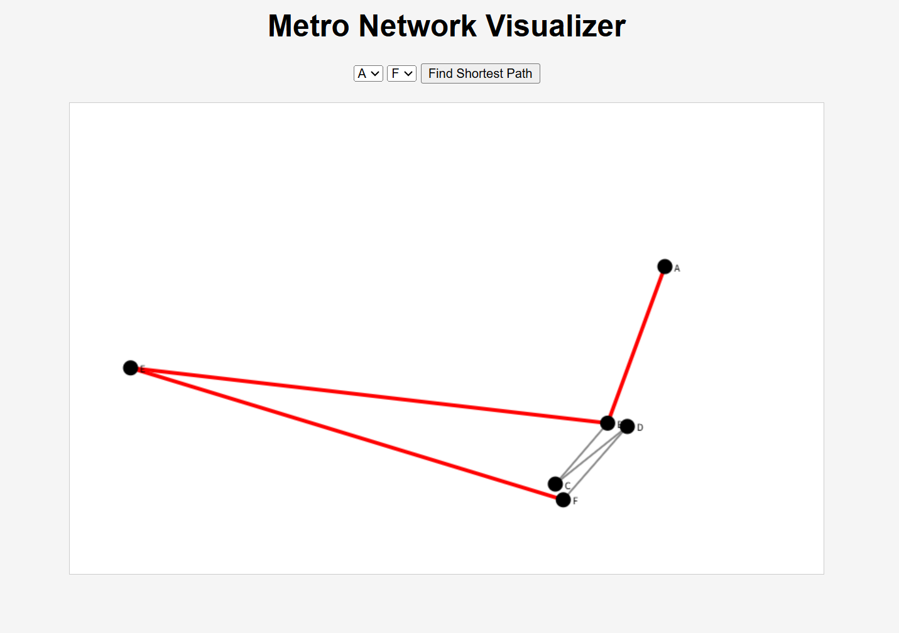
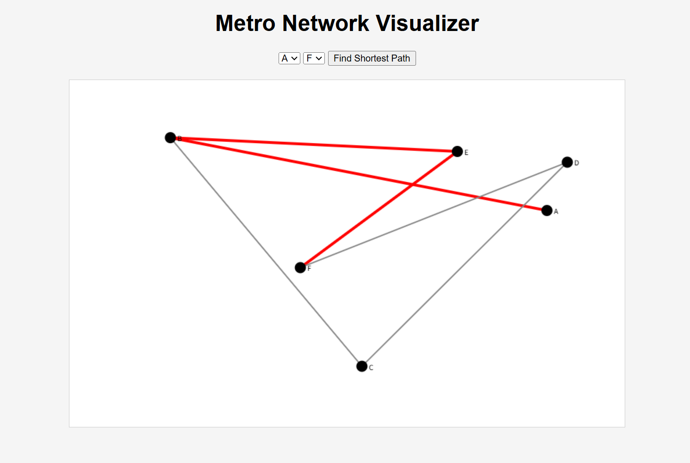

# Metro Network Simulation & Visualization

A metro routing and visualization system built with **Python**, **Flask**, and **graph algorithms**.  
This project demonstrates how transportation engineering concepts can be combined with **computer science**, including algorithms, data structures, backend APIs, and interactive visualization.

---

## 🚇 Demo Screenshots

### **screenshot 1**


### **screenshot 2**


*(Replace the filenames with your actual screenshot names)*

---

## 📌 Overview

This project implements a simplified metro network system that supports:

- Shortest-path routing using **Dijkstra’s algorithm**
- Basic timetable generation based on line headways
- Interactive **web visualization** using HTML5 Canvas
- RESTful API endpoints for graph data and routing queries

It is designed as a bridge between **transportation engineering** and **computer science**, showcasing algorithmic thinking and full‑stack development skills.

---

## 🎯 Features

### **1. Graph-Based Metro Model**
- Stations and tracks represented as a weighted graph  
- Efficient adjacency-list structure  
- JSON-based network definition  

### **2. Shortest Path Routing (Dijkstra Algorithm)**
- Computes minimum travel-time path  
- Returns both total time and station sequence  
- Implemented from scratch using a priority queue  

### **3. Timetable Simulation**
- Generates train movements based on headways  
- Produces a simplified schedule for the first 60 minutes  

### **4. Web Visualization (Flask + Canvas)**
- Interactive metro map rendered in the browser  
- Nodes and edges drawn dynamically  
- Shortest path highlighted in real time  

---

## 🧠 Algorithms & Techniques

- **Dijkstra’s Algorithm** for shortest path  
- **Graph data structures** (adjacency list)  
- **Discrete event simulation** (simplified)  
- **Flask backend** with JSON APIs  
- **HTML5 Canvas visualization**  
- **Modular Python architecture**  


---

## 🚀 How to Run

### **Install dependencies**

```bash
pip install -r requirements.txt
python app.py
http://127.0.0.1:5000
